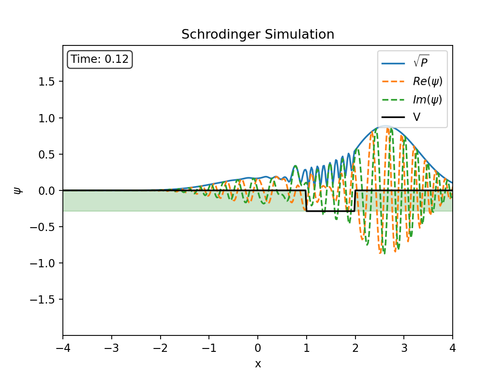

# Schrodinger Simulation

Simulating the Schrödinger Equation with Python.

## Examples

|                                                           |                                                          |
|-----------------------------------------------------------|----------------------------------------------------------|
|  |  |
|  |  |

## Overview

This project aims to solve the Schrödinger equation numerically. It includes Python scripts to help with setting up and analyzing quantum mechanical problems.

### Features
- Implementation of numerical methods for solving the Schrödinger equation.
- Flexibility to define custom initial conditions for the wavefunction.
- Simulate and view wavefunction dynamics in arbitrary potentials, including time-dependent scenarios.
- Find and view energy eigenstates and eigenvalues for arbitrary potentials.
- Jupyter notebook examples for easy understanding.
- Modular code to allow easy extension.

## Getting Started

To get started, clone the repository and install the dependencies. The project uses `pipenv` for managing Python packages.

### Prerequisites
- Python 3.11
- Pipenv for dependency management

### Installation
1. Clone the repository:
   ```sh
   git clone https://github.com/aydencook03/schrodinger_simulation.git
   ```
2. Navigate to the project directory:
   ```sh
   cd schrodinger_simulation
   ```
3. Install dependencies with `pipenv`:
   ```sh
   pipenv install
   ```

### Running the Examples

A Jupyter notebook is provided to help users learn how to use the Schrödinger equation solver step-by-step and visualize the results interactively.

To run the examples, install the development dependencies, including JupyterLab:
```sh
pipenv install --dev
```

Start a pipenv shell:
```sh
pipenv shell
```

Then open JupyterLab:
```sh
jupyter lab Examples.ipynb
```

## Project Structure
- `schrodinger.py`: Main implementation of the Schrödinger equation solver.
- `Examples.ipynb`: Jupyter notebook with usage examples.
- `Pipfile`: Dependency definitions.

## Contributing
If you wish to contribute, feel free to fork the repository and submit a pull request. Please ensure your changes include proper documentation and tests.

## License
This project is licensed under the MIT License.
