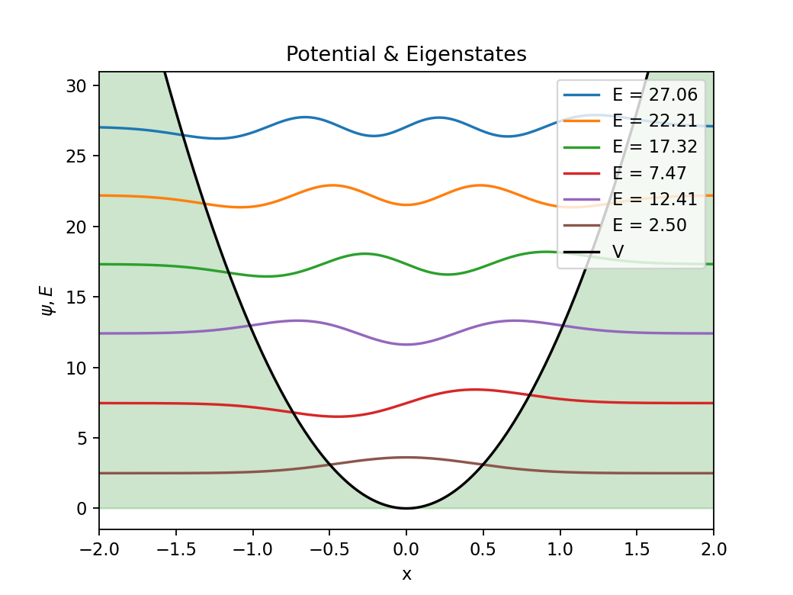

# Schrodinger Simulation
Simulating the Schrodinger Equation with Python.

## Examples

|                                                           |                                                          |
|-----------------------------------------------------------|----------------------------------------------------------|
|  |  |
|  |  |
|  |  |
